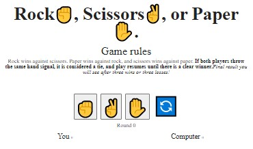

<h1 align="center">«Rock, Scissors, Paper✊-✌-✋ Game»</h1>

<h2>Descripion</h2>
 Implemented the famous kid game 'Rock, Scissors, Paper'.

<h2>Technologies</h2>

+ HTML
+ SCSS
+ JavaScript
+ Webpack 

1. Interface:
   - On the page, you should show game rules and heading.
   - After there should be three buttons - Rock, Paper, or Scissors..
   - And ‘Reset’ link..

2. Interaction:
   - After pressing one of the buttons game is started..
   - The result of every step we should show after buttons. It should look like:
      + “Round 1, Paper vs. Rock, You’ve WON!”.
      + “Round 2, Rock vs. Paper, You’ve LOST!”.
   - And after three wins or three losses, you should show the final result who is the winner.
   - Pressing reset button should clear game data and previous results on the page.

<h3 align="center"><a href="https://drozdovdenys.github.io/rock-scissors-paper/">SEE LIVE</a></h3>
